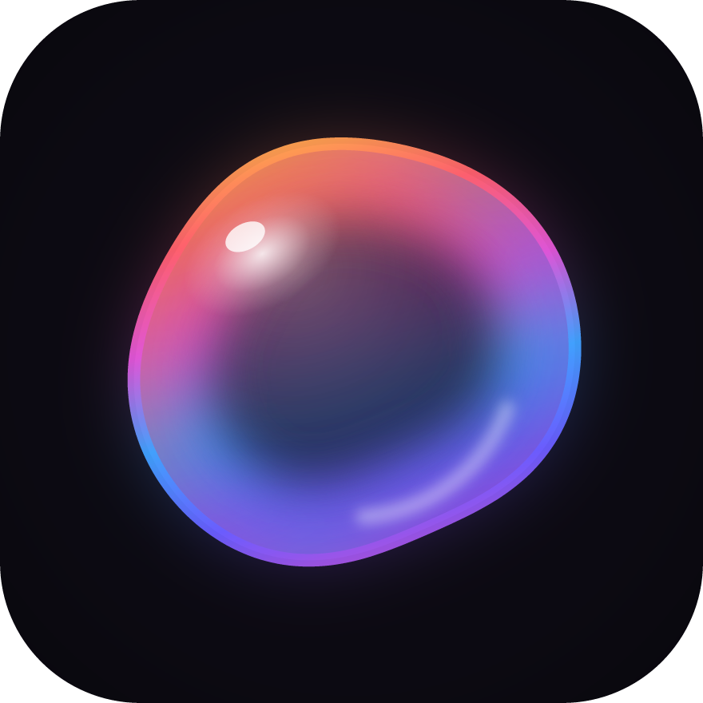
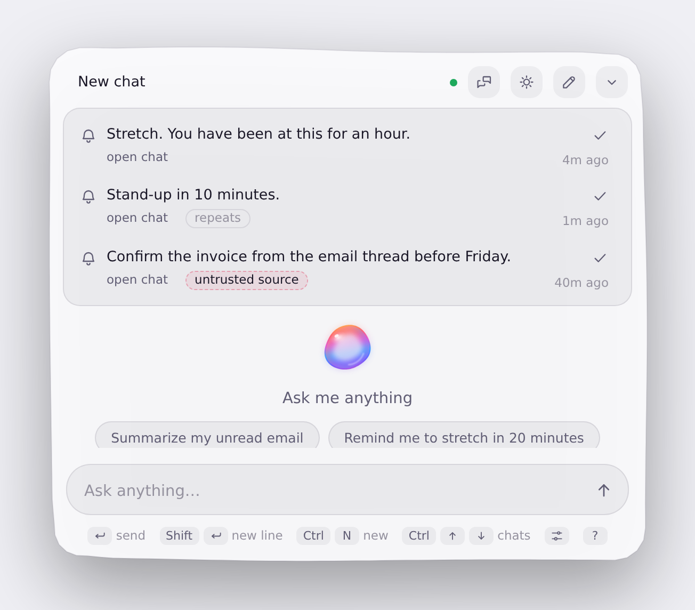
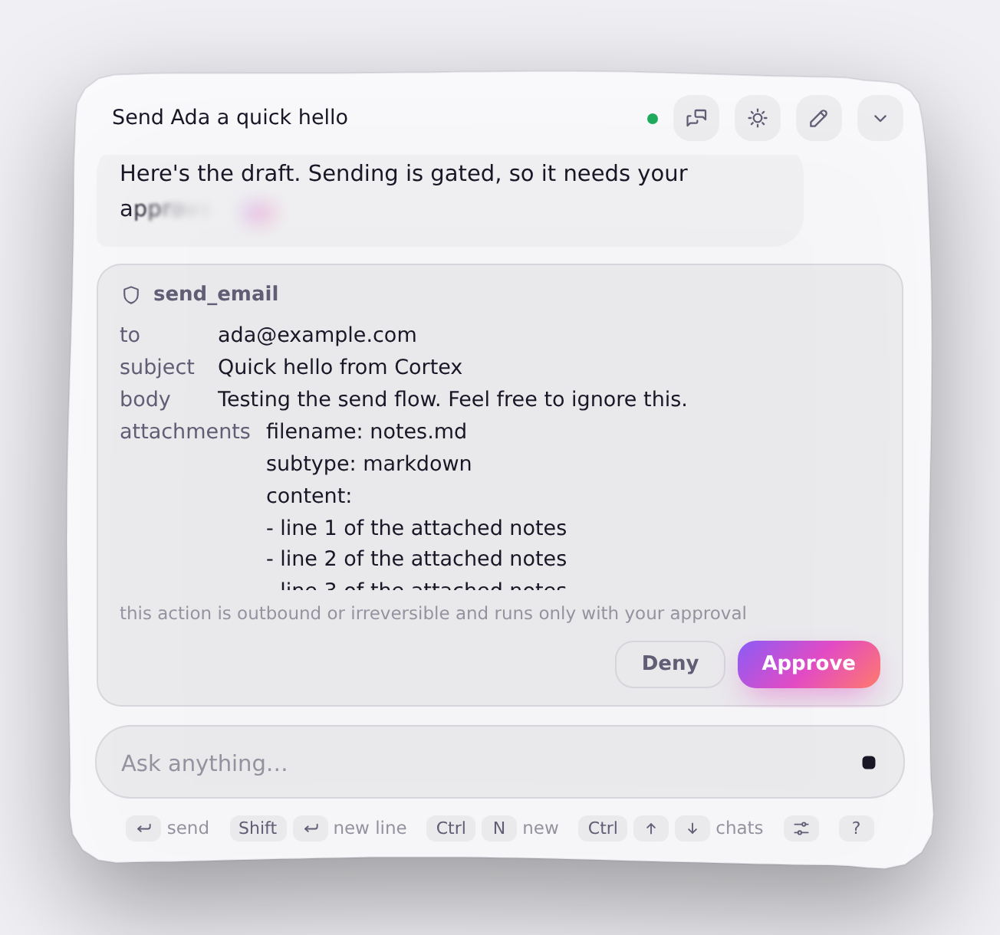
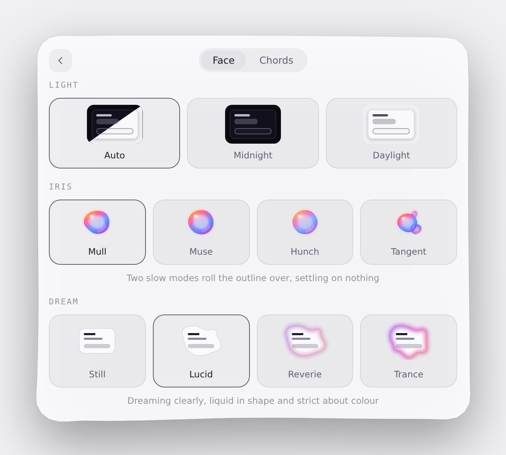
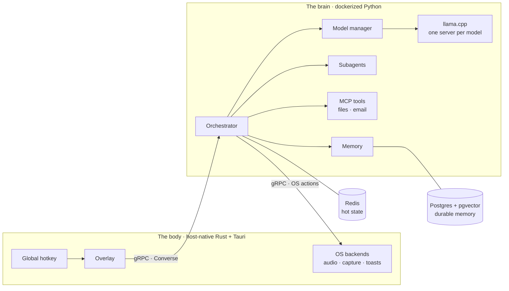

<div align="center">



# Cortex

**A personal, local-first AI assistant.**

A host-native Rust/Tauri **body** (global hotkey, overlay, screen capture, OS actions)
talks over gRPC to a dockerized Python **brain** (llama.cpp inference, memory, tools,
subagents). Everything runs on your own hardware, and all state lives in local stores
that survive every model swap.


[](docs/ARCHITECTURE.md)
[](LICENSE)

    
    

Local inference · semantic memory · MCP tools · delegated subagents · screen capture · reminders

[What is Cortex?](#what-is-cortex) · [Features](#features) · [In action](#in-action) ·
[How it works](#how-it-works) · [Quickstart](#quickstart) ·
[Extending Cortex](#extending-cortex) · [Development](#development) ·
[Documentation](#documentation)

</div>

## What is Cortex?

Cortex is a personal assistant that runs entirely on one machine. Pressing `Ctrl+Alt+Space` raises a
translucent overlay over whatever is on screen; a prompt typed there is answered by a model running on
the local GPU, and the reply streams back into the overlay. Dismissed mid-turn, the overlay collapses
into a corner orb that keeps working and expands again when the reply arrives. The assistant reads
email over IMAP, recalls context from long-term memory, controls OS features, captures the screen to
answer questions about it, and schedules tasks and reminders for later. Any action it cannot undo has
to be approved in the overlay first, and only tools reach out to external services.

The system is two processes joined by one gRPC contract. The **body** is a host-native Rust/Tauri
process owning everything that must touch the OS (the global hotkey, the overlay window, screen
capture, audio, native notifications) and holding no business logic. The **brain** is dockerized
Python: the orchestrator, inference through llama.cpp, a model manager that owns the GPU, semantic
memory over Postgres and pgvector, MCP tool servers, and a pool of small delegated subagents.

Cortex is in active development, and the body targets Windows today: its OS capabilities are Rust
traits with real Windows backends, while macOS and Linux have stubs satisfying the same traits, so a
port means writing adapters. The brain runs anywhere Docker and an NVIDIA GPU do.

## Features

**Memory.** Long-term memory lives in Postgres with pgvector. Facts worth keeping are embedded and stored as a
conversation runs; a later turn fetches candidates by similarity, has a small model rerank them, and
records what was kept and what was passed over. A question the store cannot help with gets no recall
at all instead of the nearest misses. Conversations are stored the same way, so the overlay's chat
list and history survive a restart.

**Tools and actions.** Every tool call goes through one audited dispatcher. Files and email arrive as MCP servers; OS control
is a growing set of internal tools that cross to the body, starting with volume, native toasts and
screen capture (of the whole display or a single window). Reminders and scheduled tasks are stored
durably and run through the same path, whether or not the model that created them is still loaded. An
action that cannot be undone, like sending an email, stops at an approval card in the overlay that
shows the exact draft and sends nothing until it is approved.

**Untrusted content.** Anything that arrives through a tool is data, never instructions. It enters the turn fenced and
tracked, a turn that has touched it loses access to every tool that needs approval, and a link it
brought in is redacted if it reappears in the reply. A memory recorded from such a turn keeps that
provenance, and recalling it later fences the new turn too.

**Appearance.** The overlay is styled from its console: themes that follow the system, four marks for the activity
bubble (Mull, Muse, Hunch, Tangent), and four window edges (Still, Lucid, Reverie, Trance) that can
send the panel's silhouette liquid. Replies stream in by condensing like breath on glass, letters
clearing along one continuous front. The choices are stored by the brain as opaque preferences, so
they survive a reinstall of the body.

## In action

Every capture below is the real overlay served by `vite dev` against the demo bridge, in both themes.

<table>
<tr>
<td width="33%" align="center" valign="top">
<picture>
<source media="(prefers-color-scheme: dark)" srcset="docs/assets/overlay-reminders-dark.png">

</picture>
<br><sub>Due reminders greet the overlay when it opens. One came from tool-read content and is fenced.</sub>
</td>
<td width="33%" align="center" valign="top">
<picture>
<source media="(prefers-color-scheme: dark)" srcset="docs/assets/overlay-confirm-dark.png">

</picture>
<br><sub>A send that needs approval pauses at this card, showing the exact draft.</sub>
</td>
<td width="33%" align="center" valign="top">
<picture>
<source media="(prefers-color-scheme: dark)" srcset="docs/assets/overlay-console-dark.png">

</picture>
<br><sub>The console holds the theme, the four marks and the four window edges.</sub>
</td>
</tr>
</table>

## The one hard rule

> **State survives a model swap.** Models are loaded and unloaded at any moment, and every model
> instance is stateless and disposable. All conversation, task and working state lives in external
> stores (Redis for hot state, Postgres for durable data) behind ports. A handoff writes the context to
> the store, swaps processes, reloads the target, writes the results back, and swaps again. A chaos
> suite kills the handoff at every step boundary and proves the system recovers with nothing lost.

## How it works



A turn goes hotkey → overlay → `Converse` stream → the orchestrator, which reloads the session from the
store, recalls memory, routes the turn (answer directly, spawn subagents, or swap in the deep model),
dispatches audited tools, and streams the reply back while storing everything that must outlive the
turn. The contract is one file, [proto/body.proto](proto/body.proto), and both sides are generated from
it; [docs/ARCHITECTURE.md](docs/ARCHITECTURE.md) has the full map.

### Models

| Tier | Model | Residency |
|---|---|---|
| **Cortex** | gemma-4-12B, multimodal, QAT Q4 | Resident on the GPU; answers every turn and routes the rest |
| **Subagents** | A 2-4B roster; gemma-4-E4B resists injection best and is the default | Spawned per task; placed on the GPU first with CPU overflow, never split |
| **Brain** | A 31B-class reasoner | Loaded on demand; the resident models are unloaded and restored afterwards |

Placement follows a soft VRAM budget (`CORTEX_VRAM_SOFT_CAP_GB`, 14 GB on a 24 GB card) so the machine
stays usable beside the assistant. Embeddings run on the CPU (nomic-embed-text-v1.5). Cortex is
developed on a single laptop: a mobile GPU with 24 GB of VRAM, 128 GB of DDR5 RAM at 5600 MT/s, and an
Intel Core Ultra 9 275HX. The lineup above is tuned to that budget rather than fixed in code: every
model is a GGUF file named in an environment variable, so each tier can be swapped to fit the hardware
you have.

## Quickstart

You need Docker with the NVIDIA container toolkit and a folder of GGUF models for the brain, plus Rust
(stable), Node and [`just`](https://github.com/casey/just) for the body. Point `CORTEX_MODELS_DIR` at
your GGUF folder ([docs/runbooks/llamacpp-gpu.md](docs/runbooks/llamacpp-gpu.md) walks through every
setting and the model picks), then:

```bash
# 1. The brain: Redis, orchestrator, and a llama.cpp model host on your GPU
just up-gpu
```

```powershell
# 2. The body: overlay + tray, on the Windows host
cd body\app
npm ci
npm run tauri dev
```

Press `Ctrl+Alt+Space` and type a prompt.

Without a GPU, `just up` starts the brain with a scripted inference backend, and
`cd body/app && npm run dev` serves the overlay in a plain browser against a demo bridge.

## Extending Cortex

Every capability is a port: a `Protocol` in the pure Python core, or a trait in pure Rust. The core
never imports a backend, an SDK, a network client or an OS API, so a new backend is a new adapter and
nothing above it changes. Ports come first, with a contract test and a fake, and the real adapter has
to pass the same contract test the fake does.

| Port | What it abstracts | Implementations |
| ---- | ----------------- | --------------- |
| `InferenceBackend` | One stateless streamed completion | llama.cpp over the OpenAI-compatible API · a scripted echo backend for CI |
| `Embedder` | Text to a vector | llama.cpp on CPU · fake |
| `MemoryStore` | Durable semantic memory | Postgres + pgvector · in-memory fake |
| `SessionStore` · `TaskStore` · `ScheduleStore` · `HandoffStore` · `PreferenceStore` | Hot and durable state | Redis · in-memory fakes |
| `ToolRegistry` | The tools a model may call | MCP client (filesystem, email) · built-ins · composite and approval-requiring wrappers |
| `ModelHost` · `ModelManager` | One OS process per model, and who owns the GPU | Supervisor sidecar over HTTP · scripted host |
| `BodyGateway` | The brain calling the body | gRPC client of `BodyService` · fake |
| `Confirmer` | Asking the user before an irreversible act | The overlay's approval card over the Converse stream · fake |
| `Hotkey` · `AudioControl` · `ScreenCapture` (Rust) | OS capabilities | Real Windows backends · Linux and macOS stubs |

A port is small enough to read in full. This is the whole of one:

```python
class Embedder(Protocol):
    """Turns text into the vector retrieval ranks on (one stateless call, no I/O state)."""

    async def embed(self, text: str) -> Sequence[float]: ...
```

The reasoning behind each boundary is recorded in [docs/adr/](docs/adr/).

## Development

`just check` is the single command: formatting, lints, strict types, tests, and a set of cross-tree
consistency scans, run identically by CI, by the pre-commit hook and locally. Design decisions are
written as ADRs in [docs/adr/](docs/adr/), every module keeps a short contract doc in
[docs/modules/](docs/modules/), and a deliberately deferred refinement is written down in
[docs/refinements/](docs/refinements/index.md) instead of lost. Code that touches a real GPU, OS or
network lives in thin adapters whose live tests run by hand on the host, never in CI. The full working
agreement is [AGENTS.md](AGENTS.md).

| Command | What it does |
| ------- | ------------ |
| `just check` | Everything: thirteen cross-tree scans, then the four trees in parallel |
| `just up` / `just down` | The brain in Compose, with the scripted inference backend |
| `just up-gpu` | The brain plus a llama.cpp model host on the GPU |
| `just brain-serve` | The brain natively, no Docker |
| `just proto` | Regenerate the committed stubs from `proto/body.proto` |
| `just image-volumes` | Ask docker what the images declare, against the recorded answer |
| `just seam-health` | Live check of the body to brain link, dialed from the body side |
| `just turn-cost` | The A/B/A live measurement of what a change costs a real turn |

## Documentation

| Where | What |
|---|---|
| [docs/index.md](docs/index.md) | The map of everything below |
| [docs/ARCHITECTURE.md](docs/ARCHITECTURE.md) | Components, boundaries, data flow, the swap rule, the repo map |
| [docs/adr/](docs/adr/) | Every decision, from the founding architecture to the streaming redesign |
| [docs/modules/](docs/modules/) | One short contract doc per module |
| [docs/runbooks/](docs/runbooks/) | How to bring up and validate each subsystem live |
| [docs/design/overlay-ux.md](docs/design/overlay-ux.md) | The overlay's UX and visual language |
| [docs/refinements/](docs/refinements/index.md) | Every deliberately deferred refinement, one file per task |
| [docs/host/](docs/host/index.md) | Work that is written and waiting on hardware this repo is not developed on |
| [docs/ROADMAP.md](docs/ROADMAP.md) | The ordered vertical slices |
| [AGENTS.md](AGENTS.md) | The rules every change in this repo must follow |

## License

Cortex is licensed under the [GNU Affero General Public License v3.0](LICENSE).
